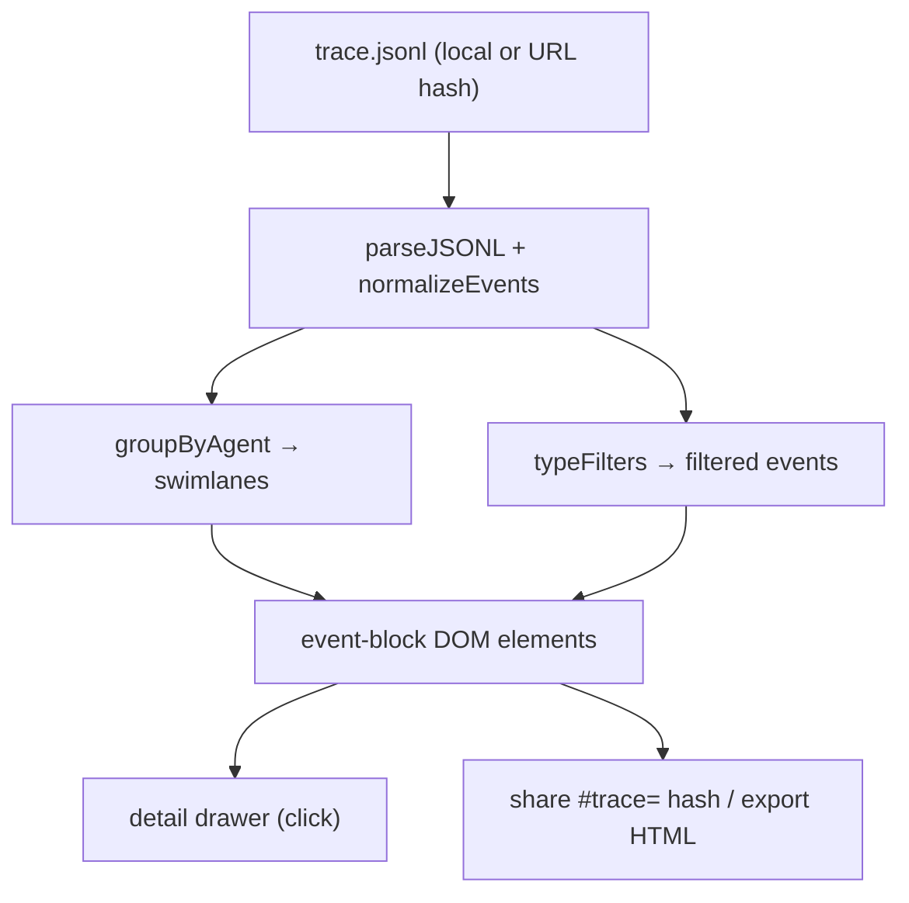

# 🌊 Traceboard

> **Drop a JSONL trace, replay what your agents actually did.** Zero backend. Pure static.

<!-- GIF PLACEHOLDER: replace this line with your screen recording -->


[](LICENSE)
[]()
[]()

---

## Why not another dashboard?

Most agent observability tools require:
- A backend / database
- An API key you paste into a settings form
- A Docker container or cloud account

Traceboard needs **nothing**. Drag in a `.jsonl` file from your local run,
see swimlanes by agent, click events for details, share a URL with colleagues
— or show it to a hiring manager at a conference on your phone.

---

## Features

| | |
|---|---|
| 🏊 **Swimlanes by agent** | Every agent gets its own row. Phase boundaries shown as dividers. |
| 🏷️ **Event type filters** | Toggle `phase_start`, `agent_call`, `error`, etc. chips to focus. |
| 🔍 **Detail drawer** | Click any event → full JSON + duration of its phase. |
| 🔗 **Share via URL** | Encodes up to 50 events as base64url in the `#trace=` hash. |
| 📤 **Export HTML snapshot** | Self-contained dark HTML table you can email or commit. |
| 🌐 **Bilingual CN/EN** | Toggle in the header. |
| 📱 **Mobile responsive** | Works on phones. |

---

## Quickstart

```bash
# Clone
git clone https://github.com/Zijian-Ni/traceboard
cd traceboard

# Install (only dev dependency: Vite)
npm install

# Dev server with hot reload
npm run dev

# Build for GitHub Pages
npm run build

# Preview the build
npm run preview
```

Open [http://localhost:5173](http://localhost:5173) and click **Load Live Demo**
to replay the bundled Aurora Orchestra triple-agent run.

Or drag any `.jsonl` trace you have locally.

---

## Trace format

Your JSONL must have one JSON object per line. Minimal example:

```jsonl
{"ts":"2026-08-15T18:35:00Z","type":"phase_start","phase":"plan","agent":"conductor","message":"Begin planning"}
{"ts":"2026-08-15T18:35:10Z","type":"agent_call","phase":"plan","agent":"worker","message":"Delegating to worker"}
{"ts":"2026-08-15T18:36:00Z","type":"phase_end","phase":"plan","agent":"conductor","message":"Plan done"}
```

**Supported fields** (all optional except one must exist):

| Field | Description |
|---|---|
| `ts` / `timestamp` | ISO-8601 string |
| `type` / `event_type` | e.g. `phase_start`, `agent_call`, `error` |
| `agent` / `agent_id` | Lane name |
| `phase` / `stage` | Groups events into phase bands |
| `message` / `msg` | Human-readable description |

---

## Architecture



Everything runs in-browser. No fetch to any server after the initial page load
(except `./demo/` for the bundled demo).

---

## Deploy to GitHub Pages

```bash
npm run build
# dist/ is the output — push it to gh-pages branch
# or set GitHub Pages source to /dist
```

`vite.config.js` uses `base: './'` so all assets resolve correctly from any
sub-path.

---

## ⭐ Use it to prove your agent run

The hardest part of showcasing multi-agent work isn't building the system —
it's making the run *legible* to someone who wasn't there.

**Traceboard turns your `trace.jsonl` into evidence:**
- A hiring manager sees parallel lanes and real timestamps, not just log lines.
- A teammate can replay the exact sequence that triggered a bug.
- You can share a URL that encodes the whole trace — no server needed.

If your agent system produces traces, Traceboard makes them shareable in 30 seconds.

---

## File structure

```
traceboard/
├── index.html          # Single-page app shell
├── src/
│   ├── main.js         # App logic, event wiring
│   ├── style.css       # Aurora dark theme
│   ├── i18n.js         # EN/ZH strings
│   ├── trace.js        # JSONL parse, layout, encode/decode
│   └── colors.js       # Agent + event type palette
├── public/
│   └── demo/
│       ├── trace.jsonl # Bundled Aurora Orchestra trace
│       └── summary.md  # Mission brief
├── docs/
│   └── HOMEPAGE.md     # Portfolio card copy
├── vite.config.js
├── package.json
└── README.md
```

---

## License

MIT © 2026 Zijian Ni
